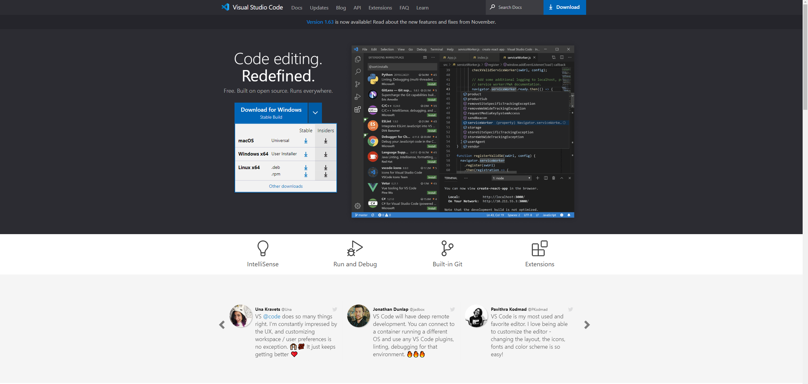
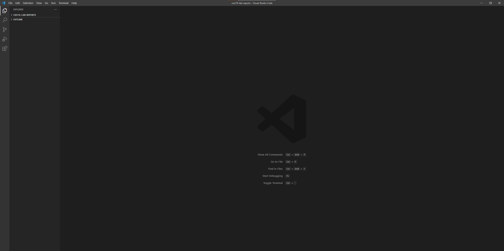
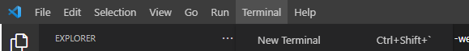
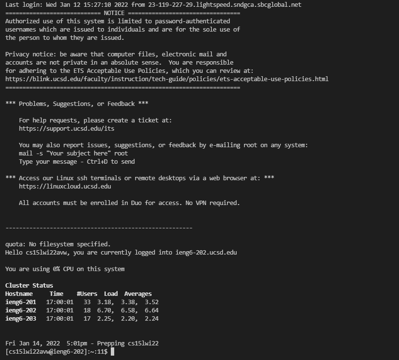
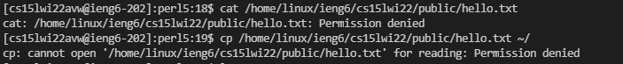
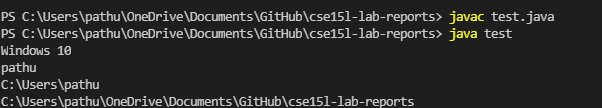
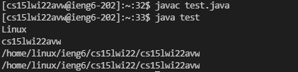
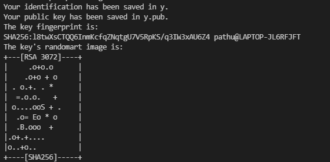
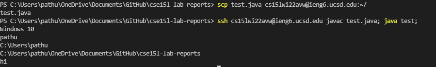

# Logging into course-specific account on ieng6

## Installing VSCode
You can install VSCode from the [VSCode website](https://code.visualstudio.com/)

Download the stable build for your operating system



After VSCode is installed and opened you should see a screen that looks like this:



---


## Remote connecting

First you will need to install open SSH by following the instructions at [This page](https://docs.microsoft.com/en-us/windows-server/administration/openssh/openssh_install_firstuse)

Next you will have to open a new terminal:



In the terminal type:

 `ssh cs15lwi22zz@ieng6.ucsd.edu`

 **note: replace the zz with your account specific characters which can be found [here](https://sdacs.ucsd.edu/~icc/index.php)**

 if it's your first time connecting you will get a message that looks like this 
 The authenticity of host 'ieng6.ucsd.edu (128.54.70.227)' can't be established.
`RSA key fingerprint is SHA256:ksruYwhnYH+sySHnHAtLUHngrPEyZTDl/1x99wUQcec.
Are you sure you want to continue connecting (yes/no/[fingerprint])?`

type yes to continue

after enetering your password you should see a screen like this:


---

## Running some commands

Some commands you can write are the following:

`cd~`

`ls -a`

`ls -lat`

`cp /home/linux/ieng6/cs15lwi22/public/hello.txt ~/`

`cat /home/linux/ieng6/cs15lwi22/public/hello.txt`

cd stands for changing directories and the ~ means home directory. Which means cd~ changes to home directory

ls lists the contents of the directory 
  * ls -a shows hidden files such as .config
  * ls -lat lists the files in a longer format

  cp copies the file at the directory specified to your home directory
  
  cat prints the contents of the file in the directory specified
  when trying out the cp and cat command you should have gotten messages that looked like this:
  

  **The reason we got this message is because we dont have permission to view this directory**

  ---

  ## Moving files over ssh with scp

  We will now learn how to copy files to the server and client
  first create a file on the client(aka your personal laptop/desktop) called test.java
  in this file enter the following code
  ```
  class test {
    public static void main(String[] args) {
      System.out.println(System.getProperty("os.name"));
      System.out.println(System.getProperty("user.name"));
      System.out.println(System.getProperty("user.home"));
      System.out.println(System.getProperty("user.dir"));
    }
  }
  ```
  You can run the file using these commands in a new terminal not connected to server

```
javac test.java
java test
```

The output should show you your operating system, username, home directory, and current directory


Now if we run this same file in the server we should see an output corresponding to that server 

In the same terminal that we ran the javac/java commands type the following:

`scp test.java cs15lwi22zz@ieng6.ucsd.edu:~/`

**NOTE: Once again replace the zz with the characters corresponding to your loging**

Now return to the terminal logged into the .ieng6 server (or recconect to the server)

Try typing in:
```
javac test.java
java test
```
this time you should see an output that corresponds to the server you are connected to:



---
## Creating an SSH Key

On a terminal connected to your computer (not the server) type `ssh-keygen` 

Then you should get a prompt which asks for a file to save it in, type `/Users/[Your Username]/.ssh/id_rsa`

**NOTE: replace [Your Username] with your username

If you're one windows the ssh -add step on this [page](https://docs.microsoft.com/en-us/windows-server/administration/openssh/openssh_keymanagement#user-key-generation)

You should see an output that looks like this:



Pay attention to the message that looks something like this:

`Your public key has been saved in /Users/[Your Username]/.ssh/id_rsa.pub`

On the server type `mkdir .ssh`

Next, on your client type `scp /Users/[Your Username]/.ssh/id_rsa.pub`


Now you should be able to interact with the server without entering your password everytime

---

## Making remote running easier

We can easily upload local changes and run them on the server by doing the following steps

1. Make a change to a local file (add `System.out.println("hi");` to test.java and save it)
2. type scp test.java cs15lwi22zz@ieng6.ucsd.edu:~/ in terminal **NOTE: replace zz with personal characters**
3. Type ssh cs15lwi22@ieng6.ucsd.edu javac test.java; java test;

When you do this you should get an output that reflects the changes:



