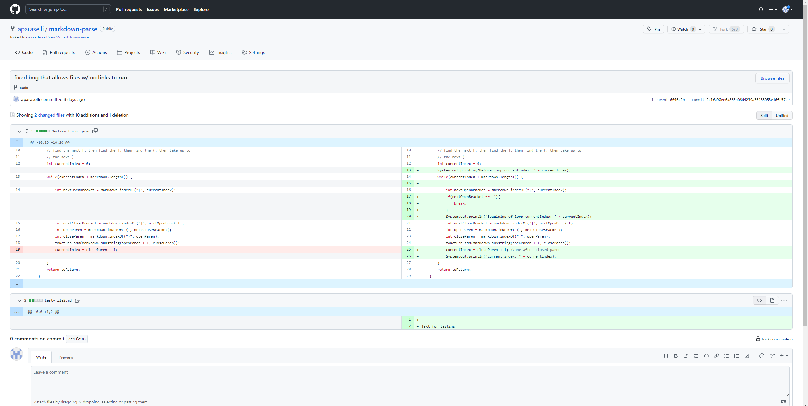
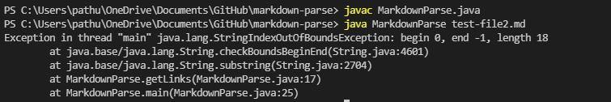
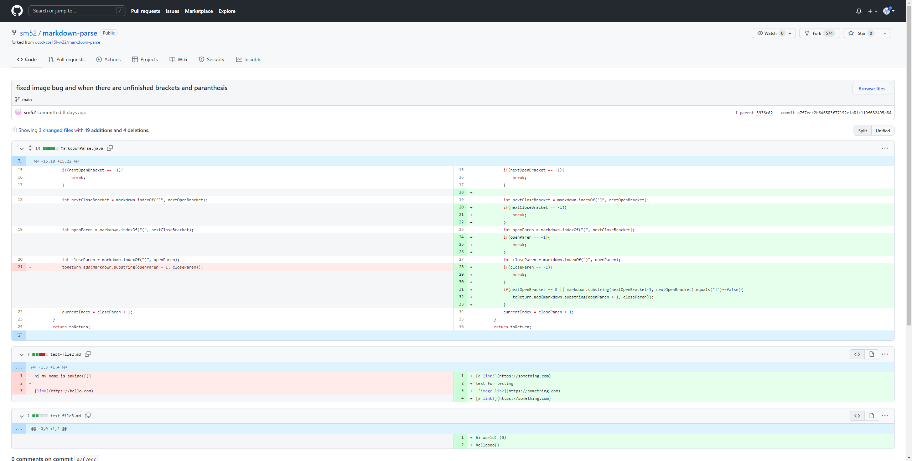
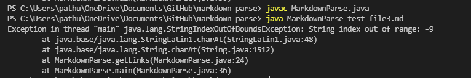
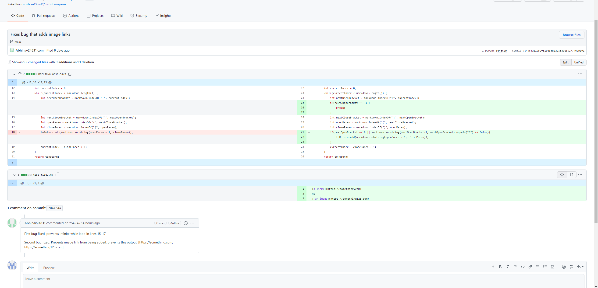
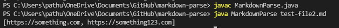

# Week 4 Lab Report

## Fixed bug which would cause errors when files with no links were input

[This is the file that was producing the unwanted output](https://github.com/aparaselli/markdown-parse/blob/main/test-file2.md)

The file contained no links and only had text

When we entered a file with no string we would get an index out of bounds error. This is because of a bug in the code where we assumed that there would be a []/(). Because of this assumption, code was written to manipulate a substring based on the index recieved of those positions, but if the index recieved was not in the bounds of the string then the symptom (IndexOutOfBoundsError) appeared.

---

## Fixed bug which would cause files with ()[] to go into an infinite loop

[This is the test file that was producing the unwanted output](https://github.com/sm52/markdown-parse/blob/main/test-file3.md)

This file contained a () and a [] without a link.

This symptom is similar to the last one we encountered. This symptom was caused by the assumption that every [] would have a () after it (However our failing induced input did not follow this assumption). This meant that when the code had to create a new substring to contain the link that we were looking for it would try to enter indexes that were out of bounds.

---

## Fixed bug where links to image files would be added to the output of MarkdownParse

[This is the input that was producing the unintended output](https://github.com/Abhinav24831/markdown-parse/blob/main/test-file2.md)

This file contained a an image link which follows a similar format to inserting a link in a markdown file

While this code compiled and ran it had a symptom of causing image links to be included in the output. Since the intended function of the code is to only return links, a file containing a image was considered a failure - inducing input. The bug for this occured due to the fact that the program had been designed to include any test between parenthesis after brackets in the output array.