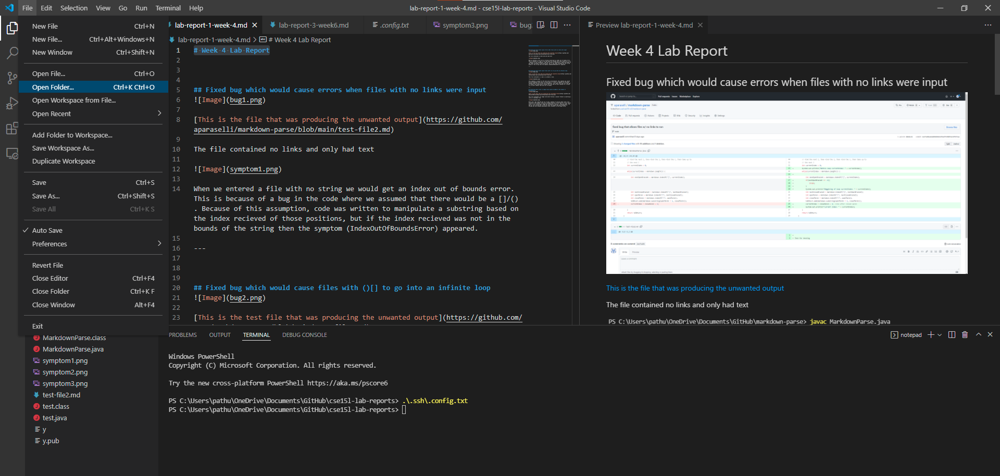
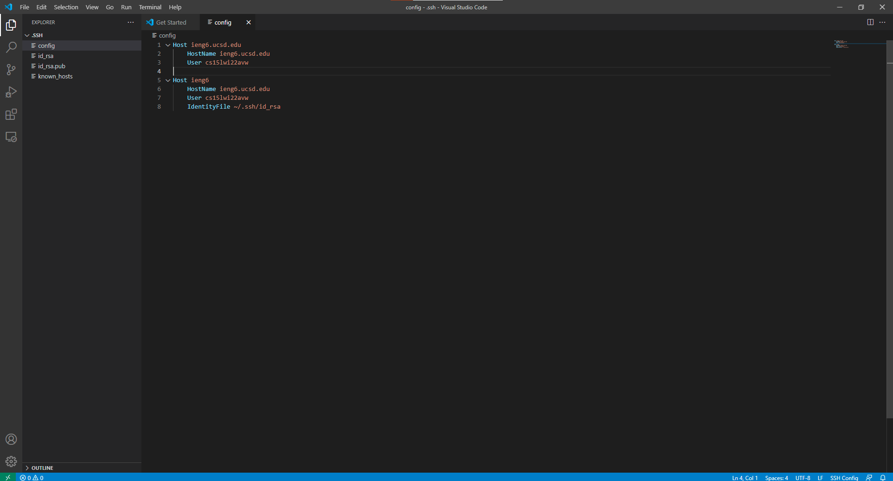
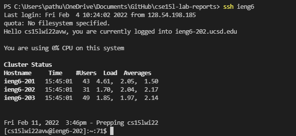

# Week 6 Lab Report (Streamlining ssh config)

## How I edited config file

I started by clicking open folder in vscode

I then navigated to my .ssh file which for me was stored in Users

Finally I entered the text that I wanted to into the .config file

Instead of doing this I could have also edited the config file in notepad, but I choose to use vscode because I believe the interface is cleaner than notepad.

--- 

## Logging into ssh using the alias

The alias that I decided to stick with was "ieng6".
An alias is assentially a keyword that you can type which will autimatically go to the config file and enter the information associated with the alias.

--- 

## Showing scp copying a file using alias

Once again my alias is "ieng6"

By streamlining the ssh process through using the alias and keys, I am able to login to the UCSD servers without having to type/lookup my username every single time