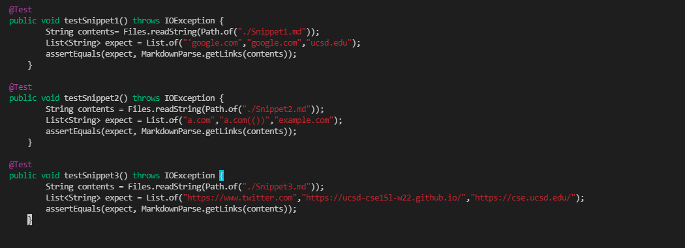
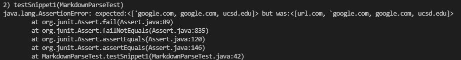
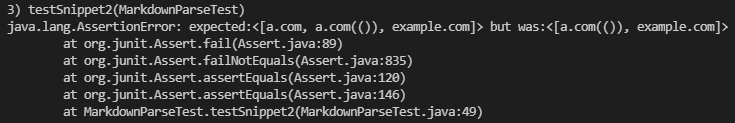
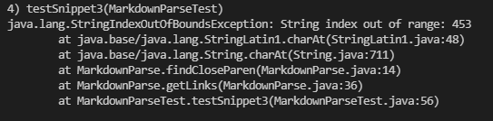
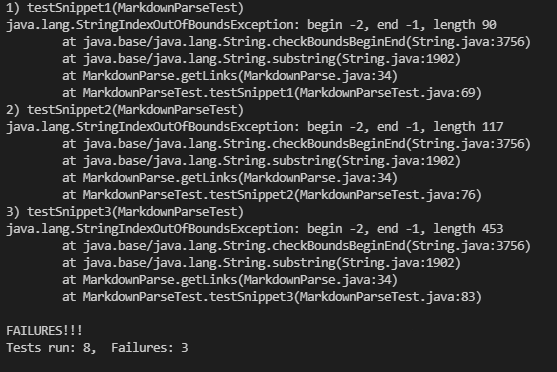

# Week 8 lab report
[Link to reviewed repo](https://github.com/Alanine42/markdown-parse)

[Link to own repo](https://github.com/aparaselli/markdown-parse)

For the tests I decided that the output of markdownparse should agree with what links VScode's preview shows

My tests were done by creating an array list with the expected output, and using assert equals to compare that to the output from MarkdownParse.

---
## Reviewed Repo
Reviewed Repo for snippet1 test:

Reviewed Repo for snippet2 test:

Reviewed Repo for snippet3 test:

---
## My repo

All test cases failed:

---
## Answering Questions

Question 1:
 I believe that the fix for this provlem would be pretty simple. This is because checking for if there are ''' around a set of parenthesis would be as simple as doing a greater than/less than index compare statement. Although the tests failed because of an string index out of range error I believe that fix is only one line.

Question 2:
I think that the fix is relatively small because checking for nested parenthesis can be done with a for loop. However even though it might be able to be written with 10 lines of code I believe that the solution may be relatively complex because it make need to use multiple variables/ADTS. Once again I think that the string index out of range error that I got could be fixed with an edit to 1 or 2 lines.

Question 3:
I think that this fix would be pretty big because in order to fix the error I may need to first create a mathod that matches parenthesis. Which would be similar to the work needed in question 2. Then on top of that I would need to figure out a way to mark segments where there is no corresponding parenthesis which would likely take more than 10 lines of code.

