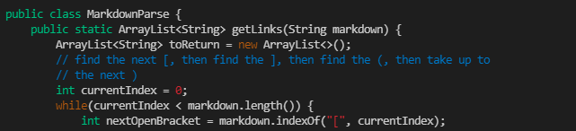
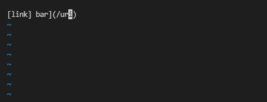

# Week 10 lab report
## Bug 1
By using diff results.txt ../markdown-parsePolitz/results.txt I was able
to get a breakdown of how the two files differed. In this breakdown I saw that the
outputs for 530.md were different. 

The output that my mdparse gave was 

 but Politz's returned:

 
  I believe that Politz has the correct output since a file name is distinctly different from a website link. 

  In order to fix this, we could add an if to check if before the nextOpenBracket a ! exists because images all include an ! before the open bracket but links dont. And if we do find an ! we would skip adding this next stuff in the parenthesis to the array.
  
  

  ---

  ## Bug 2
  Once again I used diff results.txt ../markdown-parsePolitz/results.txt to look for files that differed between the two mdParse outputs. I saw that 512 had different outputs, which file looked like this:
  
  

  The output that our mdparse gave us was:
   
   

   
   
   but Politz's returned:
   
   

I believe that Politz implementation is correct because although that isnt a vlid url it was formatted in the style to be linked to, so therefore we should include that when creating an array of links. Our implementation was also wrong because it caused an error which should be avoided no matter what in this program because the nature of the problem means that either something is or is not parsed, there should be no ambiguity. 

In order to fix this bug we could attempt to check to see if the index we set to the close bracket is the last closed bracket without an open bracket pair.

In the code above we could add an else if after the check for nextCloserBracket==-1 to see if the next closed bracket that is after nextCloseBracket is at an index lower than the next closed bracket that is after nextCloseBracket, and if it is then set nextCloseBracket = markdown.indexOf("]", nextCloseBracket).